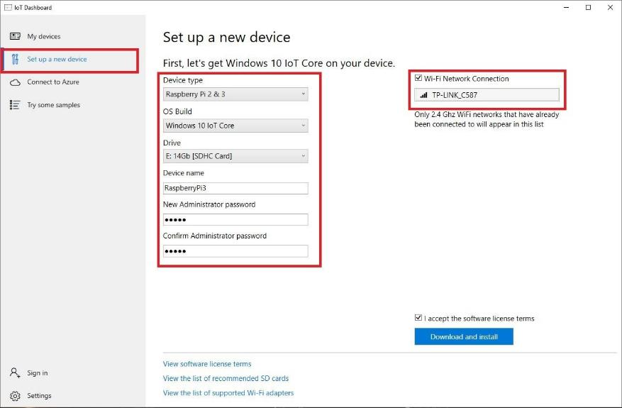
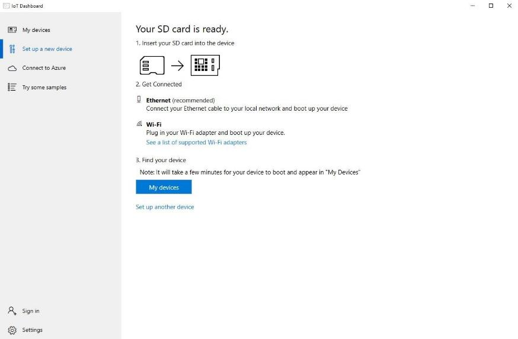
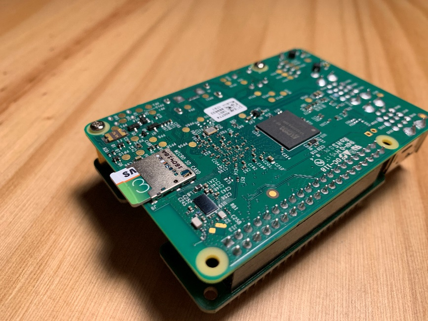
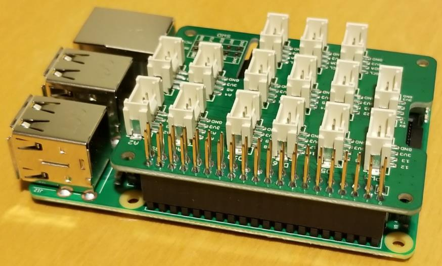
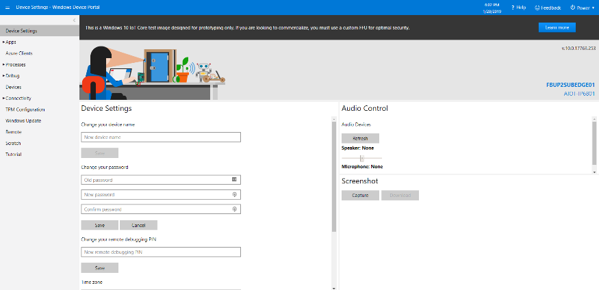
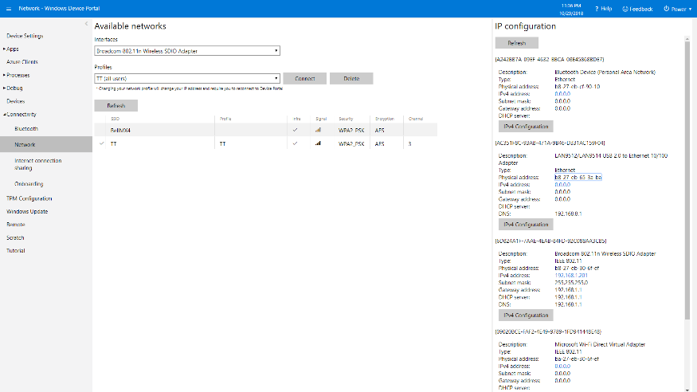

Document purpose
================

This lab document is to help students with the FarmBeats Student Kit hardware
setup. It includes installing Windows 10 IoT Core on your Raspberry Pi,
installing the sensor software, connecting the sensors and getting the device
claim code needed to register the device in the [FarmBeats Student Kit
Portal](https://farmbeatsstudentkit.com) and Azure IoT Central cloud service.

Setting up your sensor device
=============================

Windows 10 IoT Core is a version of Windows 10 that is optimized for smaller
devices with or without a display, and that runs on small devices like the
Raspberry Pi 3. Windows 10 IoT Core utilizes the extensible Universal Windows
Platform (UWP) API for building rich Internet of Things solutions.

Installing Windows 10 IoT Core on you Raspberry Pi 3
----------------------------------------------------

1.  Go to the [Windows 10 IoT Core Dashboard Documentation
    Page](https://docs.microsoft.com/en-us/windows/iot-core/connect-your-device/iotdashboard)

2.  Click **Get Windows 10 IoT Core Dashboard**

1.  Install the dashboard application and open it

2.  Select **set up a new device** from the side bar.

3.  Select the options as shown in the image below. Make sure you select the
    correct drive for your microSD card and give your device a name and admin
    password.

    1.  You may need to use the SD card adapter and install it in a USB port on
        your PC

1.  Select the Wi-Fi network connection you want your Raspberry Pi to connect
    to, if required. Only wi-fi networks your PC already connects to will be
    shown. The Wi-Fi information from your PC will be shared with the Raspberry
    Pi.

2.  Select the **I accept the software license** terms and click **download and
    install.**

The application will now download the necessary files from Microsoft and flash
them to your microSD card. It'll take a little while, but the dashboard will
show you the progress.

1.  Once the image has been installed on the microSD card, you will get the
    message “Your SD card is ready”. Now it's time to eject it from your PC and
    go over to the Raspberry Pi and insert it into the slot on the underneath.

>   image1.jpeg

Connect Sensors
---------------

Adding sensors to your Raspberry Pi is easy.

1.  Add Grove Base Hat to your Raspberry Pi. Match the end pins up and press
    down firmly.

1.  It’s also a good idea to screw in the supports on the side opposite the pins
    to provide support and stop the other side of the board from collapsing.

1.  Plug the Capacitive Soil Moisture Sensor into socket A2. If you have a
    second one plug it into A4.

1.  Plug the Light Sensor into socket A0.

1.  Plug the Barometer Sensor (BME280) with Temperature and Humidity into the
    bottom left I2C socket.

1.  Once all your sensors are plugged in you should have something that looks
    like this.

    

Connecting to the LAN and Internet
----------------------------------

There are multiple options to getting your Raspberry Pi online and manageable by
your PC. Ideally you would have the PC and Raspberry Pi on the same network.

1.  **Ethernet Cabled** - LAN cables into the same hub or switch work the best.
    Get them both plugged into the same device for the easiest way to connect
    them.

2.  **Wi-Fi** - During the creation of the device image you had the option of
    having the Raspberry Pi join a wi-fi as part of the SD Card build. If that
    didn’t work then see this page for more details
    <https://docs.microsoft.com/en-us/windows/iot-core/connect-your-device/setupwifi>

3.  **Mouse, Keyboard, Monitor** – it’s also ideal to connect a mouse, keyboard
    and monitor to the device which can help you provision wi-fi or lookup the
    IP address if you are plugged into ethernet. You can use the console to see
    the network IP address.

Power on
--------

1.  Plug the large end of the micro USB cable into the power adapter

2.  Plug the small end of the micro USB cable into the Raspberry Pi and Power
    Up!

The Operating System Out of the box setup process. (if you have connected a mouse monitor and keyboard)
-------------------------------------------------------------------------------------------------------

Unlike your Windows 10 desktop, laptop or tablet, there's not much of a setup
process.

1.  You'll be asked to choose a language

2.  Select the level of information you want to send back to Microsoft.

3.  Select the privacy setting for sharing your location.

4.  If not already connected via Ethernet cable or with Wi-Fi details it was
    provided when you installed the SD card then you will be asked to enter your
    Wi-Fi password to connect to the web. If needed, connect a keyboard to
    complete this step.

It'll take a couple of minutes, but when booted up you'll see the Windows 10 IoT
Core splash screen. There is not much to see here, the Windows 10 Operating
System part is designed to disappear, since once you deploy an app to your
Raspberry Pi, it becomes that app. There's no flipping in and out of Windows and
launching apps like you would on a PC.

1.  When booted, check that you have a valid IP address.

Now you can go back to the dashboard application on your PC, and you'll see your
Raspberry Pi listed as one of your devices.

Configuring Windows 10 IoT Core
-------------------------------

1.  In the Windows IoT Dashboard select the **My devices** tab on the top left.

2.  In the **My devices** page right click on your Raspberry Pi to access the
    menu.

3.  Select the **Open in device portal** menu item

1.  Login to Windows Device Portal using the username **Administrator** and the
    password you used when making the SD card. The [Windows Device
    Portal](https://docs.microsoft.com/en-us/windows/iot-core/manage-your-device/DevicePortal)
    (WDP) lets you configure and manage your device remotely over your local
    network.

1.  Select **Connectivity** on the menu on the left.

2.  Record the Mac address of your LAN card

1.  Check for Windows Updates (Tests internet connectivity)

2.  Change your Time zone (optional)

Installing Gateway Application
------------------------------

1.  Download and unzip the latest [Sensor
    Application](https://fblassets.blob.core.windows.net/releases/FarmBeatsLabs.UWP.Headless_1.0.11.0_arm.zip)
    software.

2.  Install Application onto Windows 10 IoT Core.

3.  Set Application to startup when device boots

Deploy device and plant together
--------------------------------

1.  Position FarmBeats Labs Indoor M1 unit near soil in an area that can provide
    power and connectivity to the Raspberry Pi device.

2.  Insert Moisture Sensor into Soil

3.  Position Temp / Humidity Sensor

4.  Setup Web Camera (optional)
