Build your Windows 10 IoT Core Sensor Device
============================================

This lab document is to help students with the FarmBeats Student Kit device
setup. It includes installing Windows 10 IoT Core on your Raspberry Pi,
installing the sensor software, connecting the sensors and getting the device
claim code needed to register the device in the [FarmBeats Student Kit
Portal](https://farmbeatsstudentkit.com) and Azure IoT Central cloud service.

To complete this stage of the installation you will require:

-   A complete FarmBeats Student Kit with Raspberry Pi and Sensors

-   A Windows PC that can download and run applications (optional)

-   A mouse, keyboard and HDMI monitor

-   An internet connection (wired preferred)

-   A small Philips head screwdriver

-   The device password “p\@ssw0rd” (for pre-installed kits)

-   The latest [FarmBeats Labs Sensor Application for the Indoor
    M1](https://fblassets.blob.core.windows.net/releases/FarmBeatsLabs.UWP.Headless_1.0.11.0_arm.zip)
    software.

Installing Windows 10 IoT Core on your Raspberry Pi 3
-----------------------------------------------------

Windows 10 IoT Core is a version of Windows 10 that is optimized for smaller
devices with or without a display, and that runs on small devices like the
Raspberry Pi 3. Windows 10 IoT Core utilizes the extensible Universal Windows
Platform (UWP) API for building rich Internet of Things solutions.

*Important Note: This step can only be completed on a Windows PC and is not
supported on a Mac Book or Chromebook.*

*This step may be optional: Some of the kits are shipped with the SD card
pre-installed. If your SD card is NOT still in the packet then you can skip this
step and jump straight to the Configure Windows 10 IoT Core section.*

*The password for the pre-installed kits is “p\@ssw0rd”*

-   Go to the [Windows 10 IoT Core Dashboard Documentation
    Page](https://docs.microsoft.com/en-us/windows/iot-core/connect-your-device/iotdashboard)

-   Select **Get Windows 10 IoT Core Dashboard**

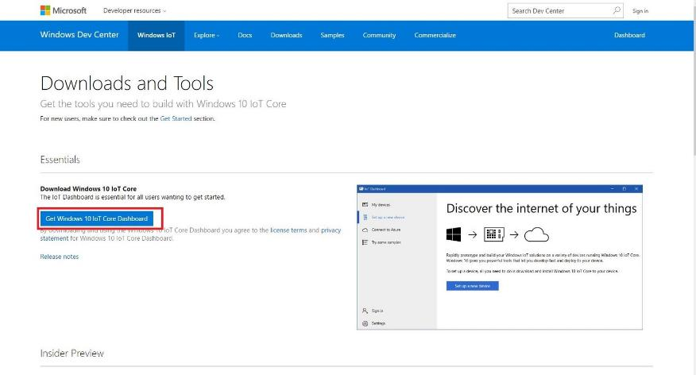

-   Install the dashboard application and open it

-   Select **set up a new device** from the side bar.

-   Insert the microSD card into your computer or laptop. You may need to use
    the SD card adapter and plug it into a USB port on your PC.

-   Select the options as shown in the image below for device type and OS Build.

-   Make sure you select the correct drive for your microSD card.

-   Give your device a friendly name and **your administrator password**. You
    will need to write down the password to use later.

-   If your device was supplied with a pre-installed operating system on the SD
    card then your administrator password is going to be “**p\@ssw0rd”**

-   If you are on a laptop or desktop with a Wi-Fi adapter you may be able to
    select the Wi-Fi network connection you want your Raspberry Pi to connect
    to. Only wi-fi networks your PC already connects to will be shown. The Wi-Fi
    information from your PC will be shared with the Raspberry Pi.

-   Select the **I accept the software license** terms and click **Download and
    install.**

-   Select continue on the Erasing the SD Card warning.

-   The application will now download the necessary files from Microsoft and
    flash them to your microSD card. It'll take a little while, but the
    dashboard will show you the progress.

-   You will get a security prompt for the Deployment Image Servicing and
    Management tool, click Yes to allow this to run.

-   When the SD card flashing is complete you will get a bunch of File Explorer
    instances launch and the PC recognizes the different partitions on the SD
    card. Do not format the disk. Remove the SD card from your PC and press
    cancel on the Format dialog and close all the remaining File Explorer
    windows.

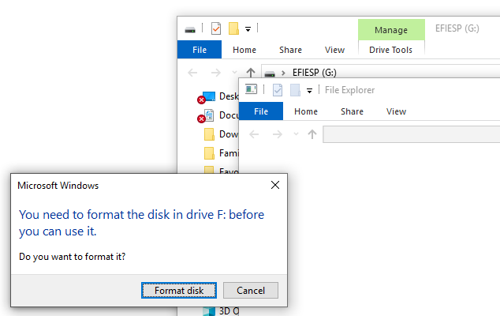

-   Once the image has been installed on the microSD card, you will get the
    screen and message **“Your SD card is ready”**.

-   Now it's time to eject the SD card from your PC and insert it into the
    Raspberry Pi slot on the underneath.

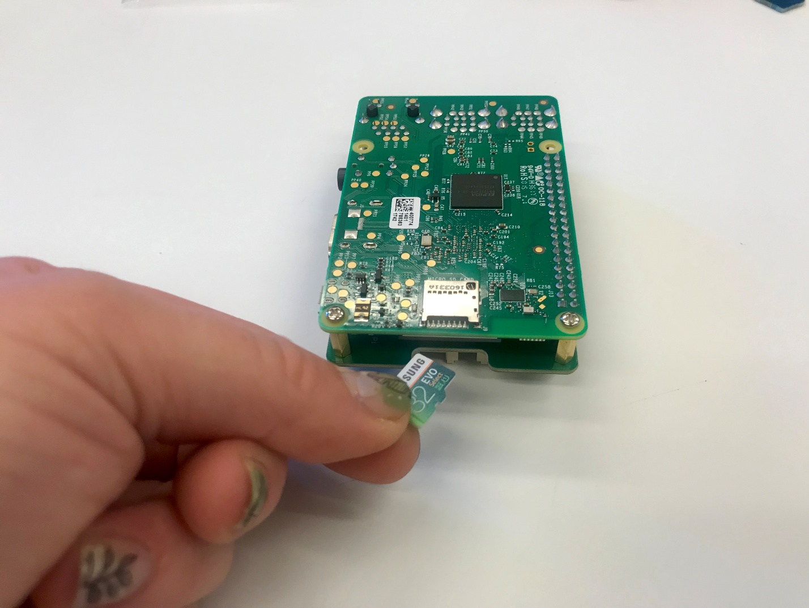

Connect Sensors
---------------

The Grove connector system makes adding sensors to your Raspberry Pi is easy.

-   Add the Grove Base Hat to your Raspberry Pi. Match the end pins up and press
    down firmly. Look at it from all angles to ensure that it is correctly
    connected.

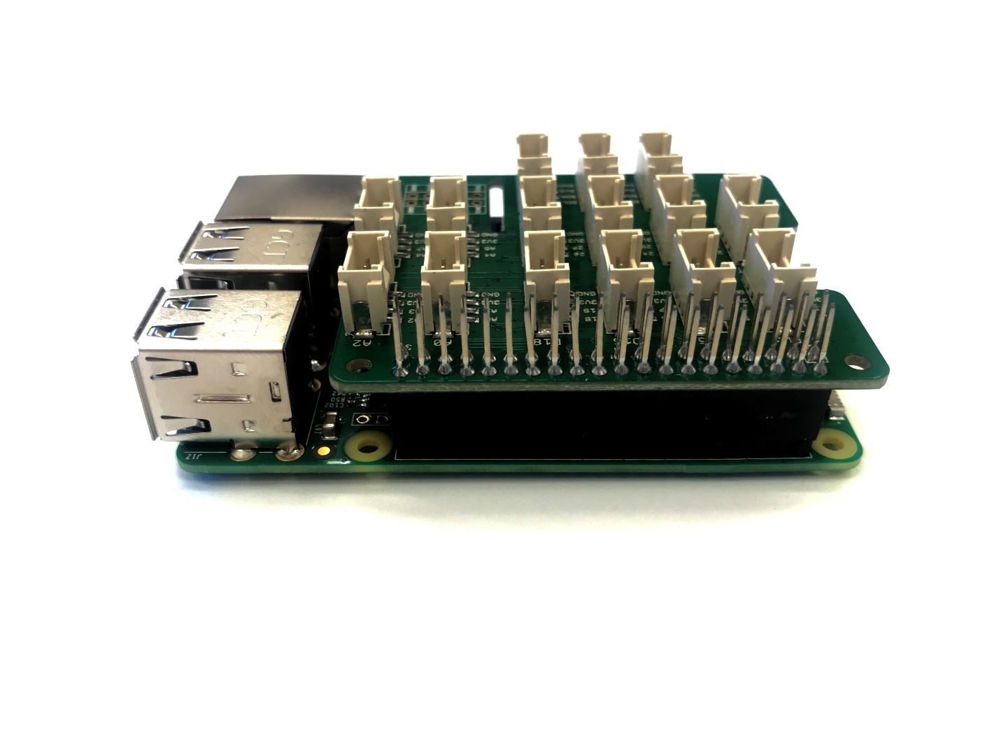

-   Screw in the supports on the side opposite the pins to stop the other side
    of the Grove Base Hat from collapsing onto the Raspberry Pi. This requires a
    small screwdriver that is not supplied with the kit sorry.

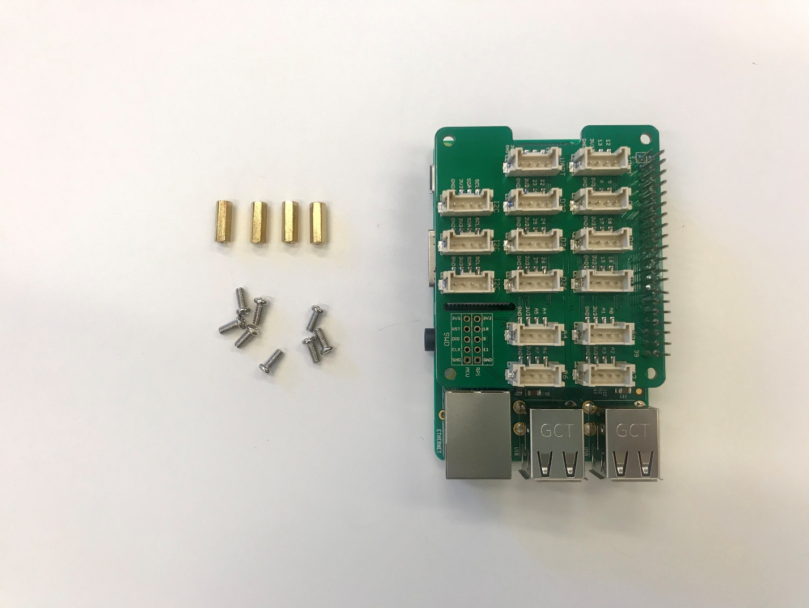

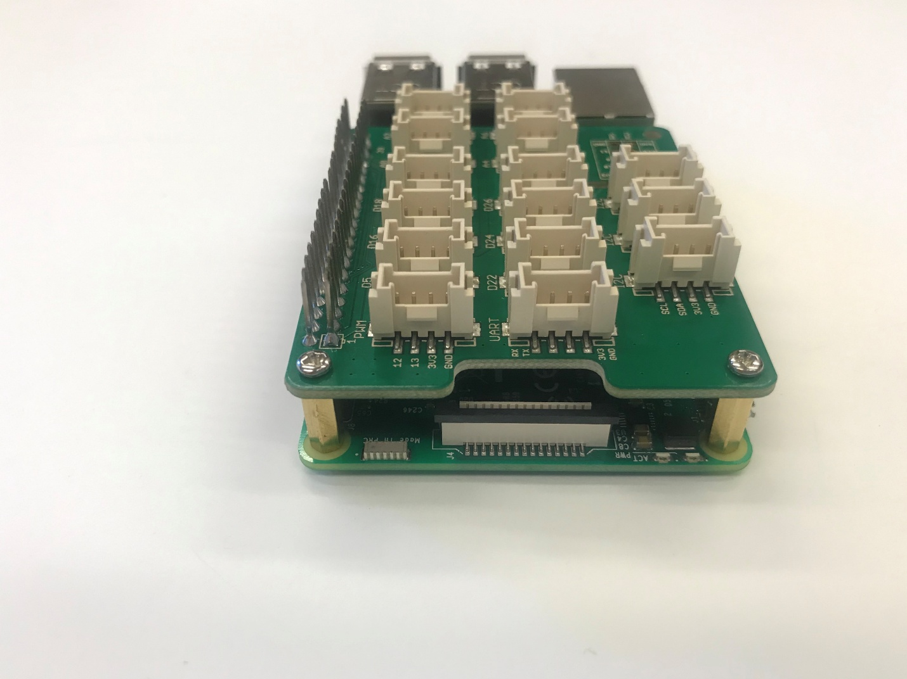

-   Plug the Capacitive Soil Moisture Sensor into socket A2. If you have a
    second one plug it into A4.

-   Plug the Light Sensor into socket A0.

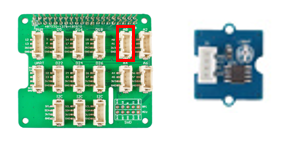

-   Plug the Temperature, Humidity and Barometer Sensor (BME280) into the bottom
    left I2C socket.

-   Once all your sensors are plugged in you should have something that looks
    like this.

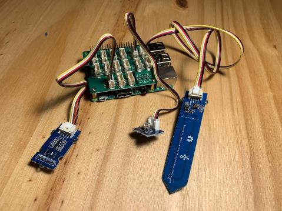

Connecting to the LAN and Internet
----------------------------------

There are multiple options to getting your Raspberry Pi online and reachable by
your PC. It’s essential to have your Raspberry Pi and PC connected to the same
network.

*Note: Internet connectivity and device to device communication is the area that
often requires the most troubleshooting. See Known Issues and Frequently Asked
Questions if you are having issues getting your device online.*

-   **Ethernet Cabled** – Plug one side of the LAN cable into the Raspberry Pi
    and the other into the same Ethernet Hub or Switch that your PC is plugged
    into.

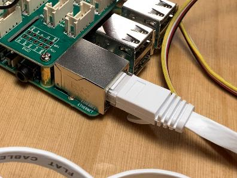

-   **Wi-Fi** - During the creation of the device image you had the option of
    having the Raspberry Pi join a wi-fi as part of the SD Card operating system
    deployment. If that doesn’t work then see this page for more details
    <https://docs.microsoft.com/en-us/windows/iot-core/connect-your-device/setupwifi>

Plug in the Mouse, Keyboard, Monitor
------------------------------------

The easiest way to troubleshoot connectivity issues and see what is going on
with your networking status is to connect a mouse, keyboard and monitor to the
Raspberry Pi device. This can help you provision wi-fi or lookup the IP address
if you are plugged into ethernet. You can use the console to see the network IP
address. There is a command line interface provided when the device is booted
that lets you do troubleshooting commands like Ping and IP Config /all.

-   Plug in the mouse and keyboard to the Raspberry Pi USB

-   Plug in the HDMI monitor to the Raspberry Pi HDMI

Power on your device
--------------------

-   Plug the large end of the micro USB cable into the power adapter and insert
    power adapter into a power source

-   Plug the small end of the micro USB cable into the Raspberry Pi and Power
    Up! A red light should shine on the motherboard.

-   Booting the device until it’s ready to use takes a few minutes. You should
    see the Windows Logo within a few seconds and be able to watch this process
    on the monitor.

The “out of the box” setup process.
-----------------------------------

You need to do a few steps on the device to complete the operating system
installation. Use the mouse, keyboard and monitor to enter configure your device
and test you are connected to the internet.

-   On the first welcome to Windows 10 IoT Core screen you will be asked to
    choose a language.

-   Next screen allows you to select the level of information you want to send
    back to Microsoft.

-   The next screen allows you to select the privacy setting for sharing your
    location.

-   The next screen will allow you to configure your Wi-Fi details. If the
    device is connected to the Ethernet this is an optional step.

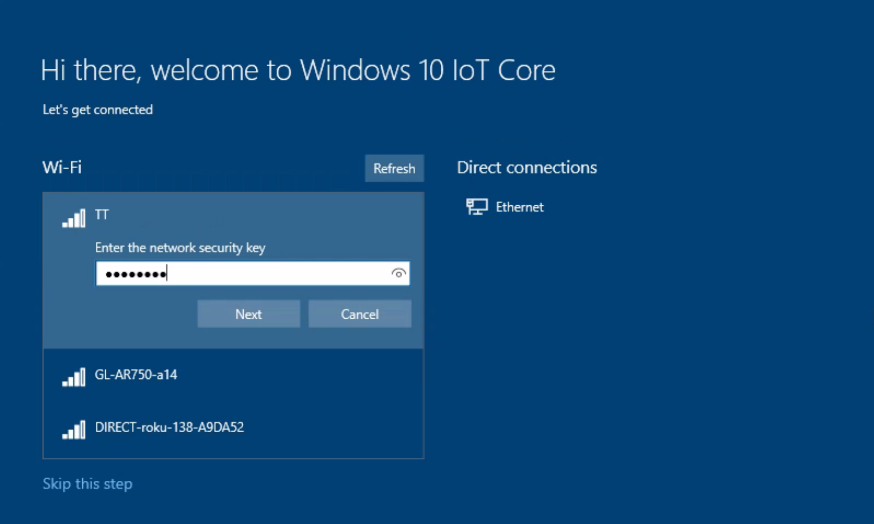

-   When configuration is finished you will be presented with the Windows IoT
    Core Default Application. This application provides you with the ability see
    basic device information, install sample applications and also provides a
    command line interface.

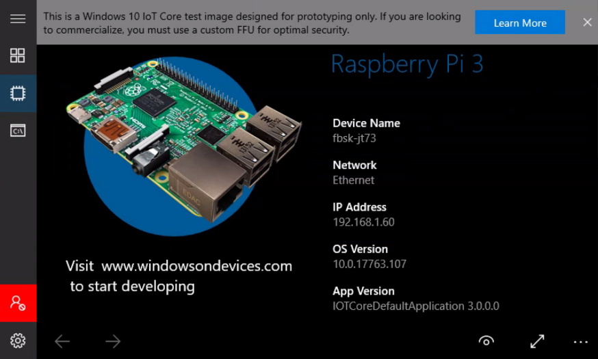

-   At this point you can remotely administer the device via a web browser. To
    access the device via a browser with the IP address followed by the port

    1.  E.g. <http://192.168.1.60:8080>

-   To test your device has internet connectivity select the command line icon
    on the left menu, type “ping 1.1.1.1” and you should get a response from a
    global DNS server.

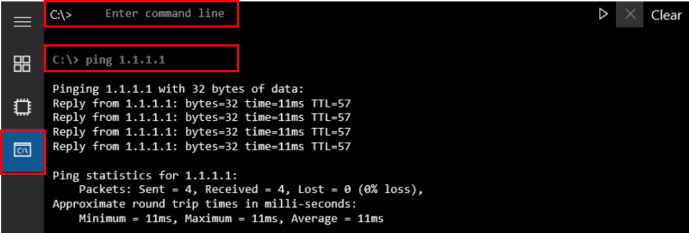

Obtaining the Device ID
-----------------------

There are two ways to collect the Device ID

-   Typing “ipconfig /all” using the Mouse, Keyboard and Monitor.

-   Remotely through the device Windows Device Portal

*Important Note: You must select the Physical address from the LAN card, not
Wi-Fi, Bluetooth or any other connection type. Description starts with LAN. Type
is Ethernet.*

*Note: All remaining steps can be done on nearly any device with a browser.
However, the Windows Device Portal is not supported on Safari. Please use Chrome
or Firefox to remotely administer your Windows 10 IoT Core device.*

### Obtaining the Device ID using Mouse, Keyboard and Monitor

Another way to obtain the Device ID is using the Mouse, Keyboard and Monitor.

-   On the Raspberry Pi, select the Command Line on the left menu.

-   Type “**ipconfig /all**” and scroll up to the Ethernet adapter Ethernet:
    section. Here you can see that the Physical Address that we are using for
    the **Device ID** is **b827eb653aba.**

### Using the Windows Device Portal to obtain the Device ID

-   If both devices are on the same network you should also now be able to go
    back to the dashboard application on your PC, and you'll see your Raspberry
    Pi listed as one of your devices.

-   The [Windows Device
    Portal](https://docs.microsoft.com/en-us/windows/iot-core/manage-your-device/DevicePortal)
    (WDP) lets you configure and manage your device remotely over your local
    network.

-   In the Windows IoT Dashboard select the **My devices** tab on the top left.

-   In the **My devices** page right click on your Raspberry Pi to access the
    menu.

-   Select the **Open in Device Portal** menu item

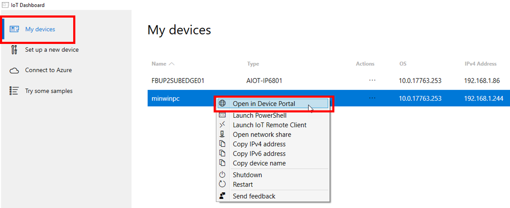

-   If you don’t see your device in the My Devices list then use the IP address
    shown on the monitor that your Raspberry Pi is connected to. To access the
    device via a browser with the IP address followed by the port 8080. E.g.
    <http://192.168.1.60:8080>

-   Login to Windows Device Portal using the username **Administrator** and the
    password you used when making the SD card. Default password is
    **“p\@ssw0rd”.**

-   Select **Connectivity** on the menu on the left, then Select **Network**

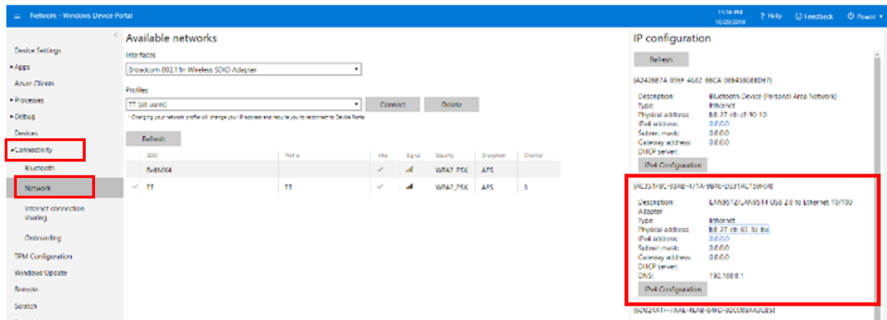

-   On the right-hand side of the screen are listed all the types of network
    connections on the Raspberry Pi. Look for the one that starts Record the
    Physical address of your **LAN** card.

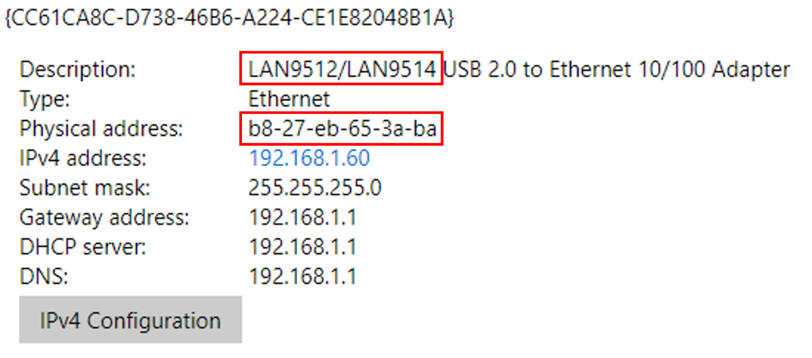

-   Look for the one that starts with LAN and record the **Physical address,
    without the dashes in between.** This is your unique device ID that is used
    as the claim code for device registration on the Student Kit Portal. In this
    example the **Device ID** is **b827eb653aba**

Installing Sensor Gateway Application Software
----------------------------------------------

The sensor application is what reads the values from the sensors and sends them
to the cloud. It is critical to the supply of data from the device and into
Azure IoT Central.

-   Download the latest [FarmBeats Labs Sensor Application for the Indoor
    M1](https://fblassets.blob.core.windows.net/releases/FarmBeatsLabs.UWP.Headless_1.0.11.0_arm.zip)
    software.

-   Unzip the contents of the zip file to a folder on your PC or laptop.

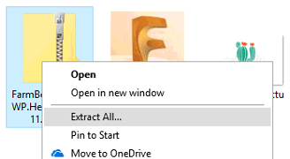

-   In the Windows Device Portal, Select **Apps** on the left menu ad then **App
    manager**

-   Select **[Choose File]** button in the **“Select the application package”**

-   Browse to the location of the downloaded files and select the file ending in
    starting with **FarmBeatsLabs** and ending in **.appxbundle** file.

-   Select the **“Allow me to select optional packages”** and click **Next**

-   Select the **[Choose File]** button, and select
    Microsoft.NET.CoreRuntime2.1.appx

-   Select the **[Choose File]** again, and select
    Microsoft.VCLibs.ARM.Debug.14.00.appx

-   Click the **Install** button

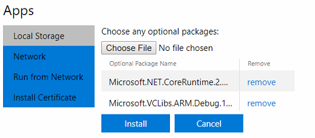

-   The application will take a little while to upload and then will pause while
    it installs. When it has finished installing it will give you a **“Package
    Successfully Registered”** message at the end with it’s complete.

-   Click **Done**

-   The application should now show up in the Apps list.

-   Set the FarmBeatsLabs Indoor Grove Base Hat to **Startup** by switching the
    toggle. This will start the application when the device boots.

Device Installation Complete
----------------------------

You have successfully installed your Windows 10 IoT Core sensor device and
software

Now proceed to [Step 2 – Register your FarmBeats Student Kit User and
Device](https://github.com/farmbeatslabs/studentkit/blob/master/Indoor-m1/2_Register_your_FarmBeats_Student_Kit_User_and_Device.md)

Optional Configuration
----------------------

-   **Check for Windows Updates.** Click Check for Updates to see if there are
    any updates for your device. This process can take a while but will download
    and install in the background.

-   **Change the device name** select “Device Settings” on the left menu. Then
    type a new name and select Save. It will prompt you to reboot the device.

